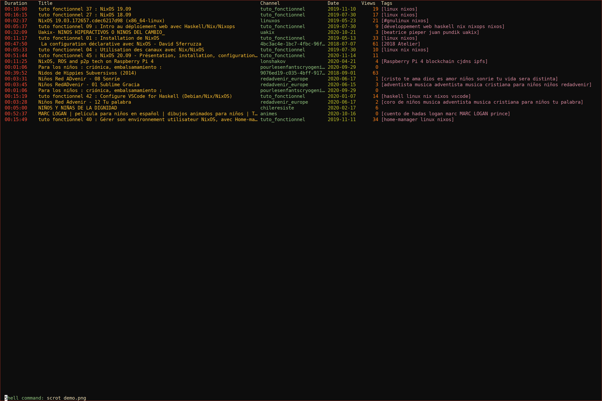

# peertube.el
`peertube.el` is an Emacs interface for querying [PeerTube](https://joinpeertube.org), insipred by [ytel](https://github.com/gRastello/ytel).

# Features
- Integration with [transmission.el](https://github.com/a13/transmission.el) for downloading videos
- It uses [tabulated list mode](https://www.gnu.org/software/emacs/manual/html_node/elisp/Tabulated-List-Mode.html) and comes with the features associated with it

# Keybindings
| Key | Function                         |
|-----+----------------------------------|
| n   | next line                        |
| p   | previous line                    |
| o   | open video with your browser     |
| d   | download video with transmission |
| s   | search for video                 |
| g   | refresh search results           |

# TODOs
- \[X\] Integrate with transmission
- \[X\] Colors based on the color theme
- \[X\] Change sorting method
- \[X\] Open channel link
- \[X\] Select resolution when downloading
- \[X\] Preview thumbnail
- \[X\] Let users specify other fields
- \[ \] Show more metadata
- \[X\] Add to MELPA/ELPA
